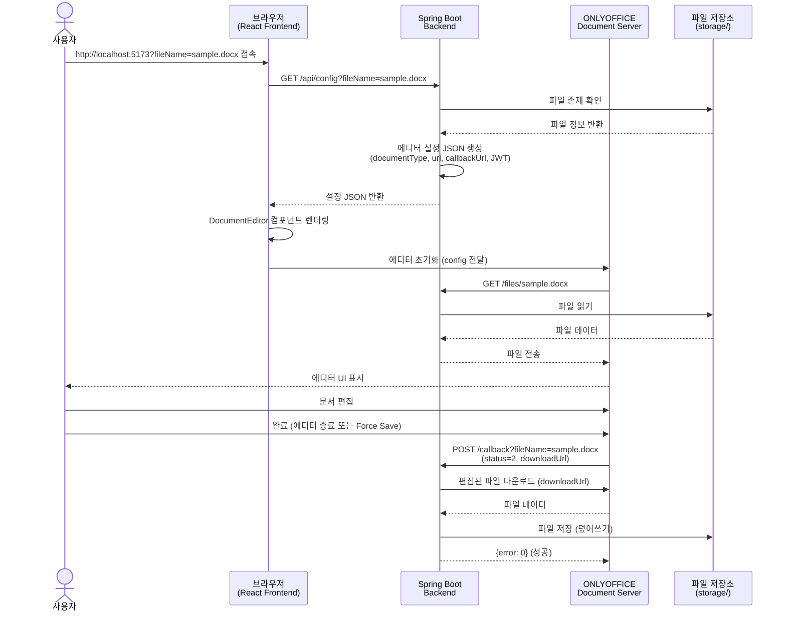

# ONLYOFFICE 문서 편집기 통합 데모

Spring Boot + React 기반 ONLYOFFICE Document Server 연동 예제 프로젝트입니다.

## 프로젝트 구조

```
onlyoffice-demo/
├── backend/                              # Spring Boot 백엔드
│   ├── src/main/java/com/example/onlyoffice/
│   │   ├── controller/
│   │   │   ├── EditorController.java    # 에디터 설정 API
│   │   │   ├── CallbackController.java  # ONLYOFFICE 콜백 처리
│   │   │   └── FileController.java      # 파일 다운로드 API
│   │   ├── service/
│   │   │   └── DocumentService.java     # 파일 관리 서비스
│   │   └── util/
│   │       └── JwtManager.java          # JWT 토큰 생성/검증
│   ├── src/main/resources/
│   │   └── application.yml              # 애플리케이션 설정
│   ├── storage/                         # 로컬 문서 저장소 (임시)
│   │   ├── sample.docx
│   │   ├── sample.xlsx
│   │   ├── sample.pptx
│   │   └── sample.pdf
│   └── build.gradle                     # Gradle 빌드 설정
│
└── frontend/                             # React 프론트엔드
    ├── src/
    │   ├── components/
    │   │   └── Editor.tsx               # ONLYOFFICE 에디터 컴포넌트
    │   ├── App.tsx                      # 메인 앱
    │   └── main.tsx                     # 엔트리 포인트
    ├── vite.config.ts                   # Vite 설정 (API 프록시)
    └── package.json
```

## 주요 기능

### 1. 문서 편집
- Word, Excel, PowerPoint, PDF 등 다양한 문서 포맷 지원
- ONLYOFFICE Document Server를 통한 브라우저 기반 편집
- 실시간 협업 편집 가능

### 2. JWT 기반 보안 (활성화됨)
- JWT 생성 로직이 구현되어 있고 활성화됨
- ONLYOFFICE Document Server가 JWT를 검증하도록 설정됨 (`JWT_ENABLED=true`)
- `.env` 파일에서 JWT Secret을 관리

### 3. 자동 저장
- 편집 완료 시 ONLYOFFICE에서 콜백 호출
- Backend가 변경된 문서를 자동으로 저장
  - 현재 로컬 디렉토리에 저장, 추후 고도화 예정
- 버전 관리를 위한 타임스탬프 기반 키 생성

## 기술 스택

### Backend
- **Java 21**
- **Spring Boot 3.3.0**
- **Gradle** - 빌드 도구
- **JJWT 0.11.5** - JWT 인증
- **Lombok** - 보일러플레이트 코드 제거

### Frontend
- **React 18.3.1**
- **TypeScript 5.9.3**
- **Vite 7.2.4** - 빌드 도구
- **@onlyoffice/document-editor-react 2.1.1** - ONLYOFFICE React 컴포넌트
- **Axios** - HTTP 클라이언트

## 사전 요구사항

1. **Java 21 이상**
2. **Node.js 18 이상** 및 **pnpm**
3. **Docker** (ONLYOFFICE Document Server 실행용)

## 빠른 시작

### 1단계: 환경 변수 설정

`.env.example` 파일을 복사하여 `.env` 파일을 생성합니다:

```bash
cp .env.example .env
```

생성된 `.env` 파일을 편집하여 다음 항목을 설정합니다:

```env
# PostgreSQL
POSTGRES_DB=onlyoffice_demo
POSTGRES_USER=demo
POSTGRES_PASSWORD=your-secure-password-here  # 안전한 비밀번호로 변경

# MinIO
MINIO_ROOT_USER=minioadmin
MINIO_ROOT_PASSWORD=your-minio-password-here  # 안전한 비밀번호로 변경

# ONLYOFFICE JWT Secret (최소 32자)
JWT_SECRET=your-secret-key-must-be-at-least-32-characters-long-for-hs256  # 강력한 비밀키로 변경
```

강력한 비밀번호와 JWT Secret을 생성하려면:

```bash
# JWT Secret 생성 (64자리 16진수)
openssl rand -hex 32

# 또는 무작위 비밀번호 생성
openssl rand -base64 16
```

### 2단계: ONLYOFFICE Document Server 및 인프라 실행

프로젝트 루트에 포함된 `docker-compose.yml`을 사용하여 PostgreSQL, MinIO, ONLYOFFICE를 한 번에 실행할 수 있습니다.

```bash
docker-compose up -d
```

모든 서비스가 정상적으로 시작되었는지 확인합니다:

```bash
docker ps
```

다음 URL들에 접속하여 서비스 상태를 확인합니다:
- ONLYOFFICE: `http://localhost:9980/welcome/`
- MinIO Console: `http://localhost:9001` (User: minioadmin, Password: `.env`에 설정한 비밀번호)
- PostgreSQL: 터미널에서 다음 명령어 실행

```bash
docker-compose exec postgres psql -U demo -d onlyoffice_demo -c "SELECT 1"
```

### 3단계: Backend 설정

`backend/src/main/resources/application.yml` 파일을 확인하여 JWT Secret이 `.env` 파일과 일치하는지 확인합니다:

```yaml
onlyoffice:
  url: http://localhost:9980
  secret: your-secret-key-must-be-at-least-32-characters-long-for-hs256 # .env 파일의 JWT_SECRET 값과 일치해야 함
```

**중요**: Docker 환경에서 ONLYOFFICE가 Backend 콜백을 호출할 때 사용하는 URL:
```yaml
server:
  baseUrl: http://host.docker.internal:8080  # Docker 환경용
  # 또는
  # baseUrl: http://localhost:8080  # 로컬 개발용
```

### 4단계: Backend 실행

```bash
cd backend
./gradlew bootRun
```

Backend가 `http://localhost:8080`에서 실행됩니다.

### 5단계: Frontend 실행

새 터미널을 열고:

```bash
cd frontend
pnpm install
pnpm dev
```

Frontend가 `http://localhost:5173`에서 실행됩니다.

### 6단계: 문서 편집기 열기

브라우저에서 다음 URL로 접속합니다:

```
http://localhost:5173?fileName=sample.docx
```

다른 샘플 파일도 테스트할 수 있습니다:
- `http://localhost:5173?fileName=sample.xlsx`
- `http://localhost:5173?fileName=sample.pptx`
- `http://localhost:5173?fileName=sample.pdf`

## API 엔드포인트

### Backend API

| 메서드 | 엔드포인트 | 설명 |
|--------|-----------|------|
| `GET` | `/api/config?fileName={name}` | ONLYOFFICE 에디터 설정 JSON 반환 |
| `GET` | `/files/{fileName}` | 파일 다운로드 (ONLYOFFICE가 호출) |
| `POST` | `/callback?fileName={name}` | 편집 완료 시 ONLYOFFICE가 호출하는 콜백 |

### 주요 흐름



## 설정 파일

### Backend: application.yml

```yaml
# Backend 기본 URL (ONLYOFFICE가 콜백을 호출할 주소)
server:
  baseUrl: http://host.docker.internal:8080

# ONLYOFFICE Document Server 설정
onlyoffice:
  url: http://localhost:9980
  secret: your-secret-key-must-be-at-least-32-characters-long-for-hs256

# 파일 저장소 설정
storage:
  path: storage
```

**주요 설정 항목:**

- `server.baseUrl`: ONLYOFFICE Document Server가 Backend에 접근할 때 사용하는 URL
  - Docker 환경: `http://host.docker.internal:8080`
  - 동일 네트워크: `http://localhost:8080` 또는 실제 IP

- `onlyoffice.url`: ONLYOFFICE Document Server 주소

- `onlyoffice.secret`: JWT 서명에 사용할 비밀키 (최소 32자)

- `storage.path`: 문서 파일이 저장된 디렉터리 경로 (backend 디렉터리 기준 상대 경로, `storage`는 `backend/storage/`를 의미)

### Frontend: vite.config.ts

```typescript
export default defineConfig({
  plugins: [react()],
  server: {
    proxy: {
      '/api': {
        target: 'http://localhost:8080',
        changeOrigin: true,
      }
    }
  }
})
```

## 보안

### 현재 보안 상태
- ✅ **JWT 적용됨**: `docker-compose.yml`을 통해 JWT가 활성화되어 실행됩니다.
- **Secret Key 관리**: `.env` 파일에서 `JWT_SECRET` 환경 변수로 관리됩니다.

### JWT Secret 관리 (필수)
1. `.env` 파일에서 `JWT_SECRET` 값 설정 (최소 32자)
2. Backend `application.yml`의 `onlyoffice.secret`이 `.env`의 `JWT_SECRET` 값과 일치하도록 설정

3. JWT 사양:
   - **알고리즘**: HS256 (HMAC with SHA-256)
   - **서명 대상**: 전체 에디터 설정 객체
   - **검증**: ONLYOFFICE Document Server가 자동으로 수행

### 프로덕션 환경 주의사항
- JWT 활성화 필수
- `onlyoffice.secret`을 환경 변수로 관리
- 강력한 랜덤 값 사용 (최소 32바이트)
- HTTPS 사용 권장
- CORS 설정 검토
- Callback 요청에 대한 JWT 검증 추가 고려

## 트러블슈팅

### ONLYOFFICE 에디터가 로드되지 않음

1. Docker 컨테이너 상태 확인:
   ```bash
   docker ps
   ```

2. ONLYOFFICE 웰컴 페이지 접속:
   ```
   http://localhost:9980/welcome/
   ```

3. Backend 로그에서 에러 확인

### 파일을 찾을 수 없음 (404)

1. `backend/storage/` 폴더에 파일이 있는지 확인:
   ```bash
   ls backend/storage/
   ```

2. `application.yml`의 `storage.path` 설정 확인:
   ```yaml
   storage:
     path: storage  # backend 디렉터리 기준 상대 경로
   ```

3. Backend 시작 시 로그 확인:
   ```
   Storage directory initialized at: /path/to/onlyoffice-demo/backend/storage
   ```

### 콜백 저장 실패

1. `server.baseUrl` 설정 확인:
   - Docker 환경: `http://host.docker.internal:8080`
   - 실제 IP 사용 가능 여부 확인

2. Backend 로그에서 CallbackController 에러 확인

3. ONLYOFFICE가 Backend에 네트워크 접근 가능한지 확인


## 개발 노트

### 파일 저장소 구조
- **파일 위치**: `backend/storage/` (backend 디렉터리 내부)
- **저장 방식**: 파일시스템 직접 접근 (상대 경로)
- **편집 파일**: 동일 디렉터리에 저장 (덮어쓰기)


### 문서 타입 자동 감지
EditorController는 파일 확장자를 기반으로 documentType을 자동으로 매핑합니다:
- `word`: docx, doc, odt, txt, rtf, pdf 등
- `cell`: xlsx, xls, ods, csv 등
- `slide`: pptx, ppt, odp 등

### PDF 읽기 전용 모드
PDF 파일은 자동으로 `edit: false`로 설정되어 읽기 전용 모드로 열립니다.

## 라이선스

이 프로젝트는 데모 및 학습 목적으로 제공됩니다.

실제 서비스에 적용 시 ONLYOFFICE의 라이선스 정책을 확인하세요:
- Community Edition: AGPLv3
- Enterprise Edition: 상용 라이선스

## 참고 자료

- [ONLYOFFICE API Documentation](https://api.onlyoffice.com/editors/basic)
- [ONLYOFFICE Document Server](https://github.com/ONLYOFFICE/DocumentServer)
- [Spring Boot Documentation](https://spring.io/projects/spring-boot)
- [React Documentation](https://react.dev)
