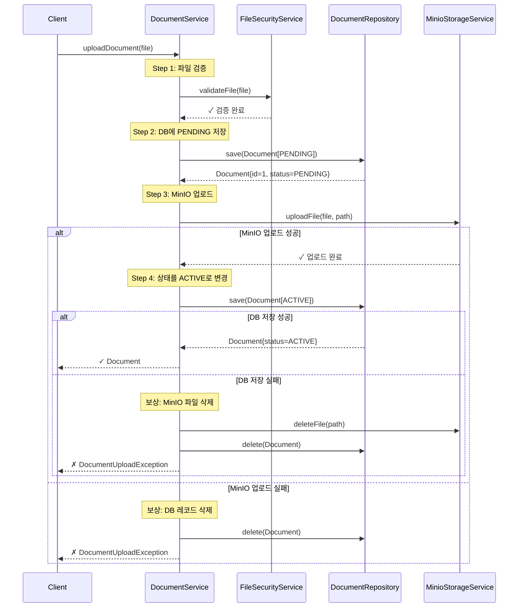
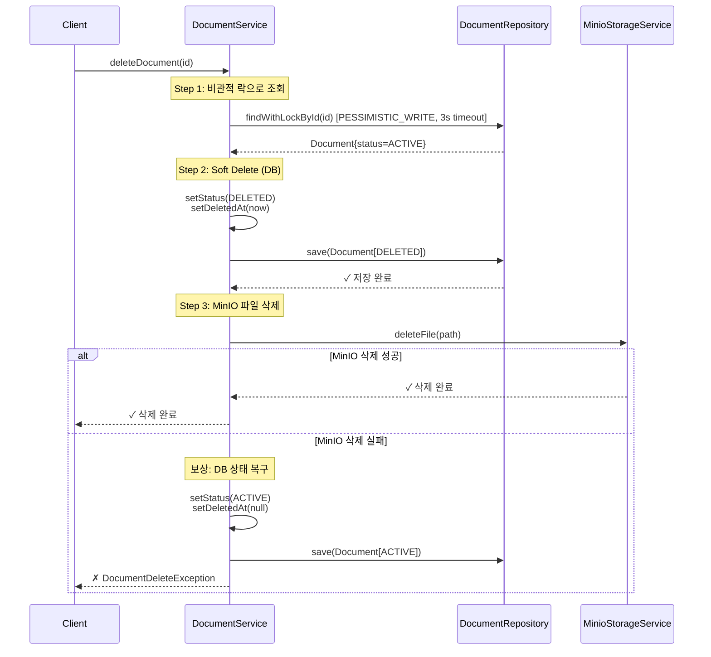

# Document Service Saga Pattern

> **문서 범례**  
> - ✅ **구현됨**: 실제 코드에 구현된 내용  
> - **권장사항**: 프로덕션 환경을 위한 제안 사항 (미구현)  
> - **예시**: 참고용 코드 샘플 (미구현)

## 개요

Document Service는 **Saga 패턴**을 사용하여 분산 트랜잭션(DB + MinIO)의 원자성을 보장합니다. 각 비즈니스 작업은 여러 단계로 구성되며, 각 단계가 실패할 경우 **보상 트랜잭션(Compensation)**을 통해 시스템을 일관된 상태로 복구합니다.

## 핵심 원칙

### 1. 상태 기반 진행
- 문서는 생명주기 동안 명확한 상태(`PENDING`, `ACTIVE`, `DELETED`)를 가집니다
- 각 단계에서 상태 변경을 통해 진행 상황을 추적합니다

### 2. 보상 트랜잭션
- 외부 시스템(MinIO) 작업 실패 시 이전 단계를 롤백합니다
- DB 작업 실패 시 외부 리소스를 정리합니다

### 3. 동시성 제어
- **비관적 락(Pessimistic Lock)**: 삭제 작업 시 동시 수정 방지
- **낙관적 락(Optimistic Lock)**: `@Version` 필드로 업데이트 충돌 감지
- **타임아웃**: 데드락 방지를 위한 3초 락 타임아웃

---

## 문서 업로드 Saga

### 플로우 다이어그램



### 단계별 설명

#### Step 1: 파일 검증
```java
fileSecurityService.validateFile(file);
```
- 파일 크기, 확장자, MIME 타입 검증
- Path Traversal 공격 방지를 위한 파일명 검증

#### Step 2: DB에 PENDING 상태로 저장
```java
Document document = Document.builder()
    .fileName(sanitizedFilename)
    .fileKey(KeyUtils.generateFileKey())
    .status(DocumentStatus.PENDING)
    .build();
document = documentRepository.save(document);
```
- 고유한 `fileKey` 생성
- 초기 상태는 `PENDING` (업로드 진행 중)

#### Step 3: MinIO에 파일 업로드
```java
storageService.uploadFile(file, storagePath);
storageUploaded = true;
```
- 실제 파일 데이터를 MinIO에 저장
- 성공 여부를 플래그로 추적

#### Step 4: 상태를 ACTIVE로 변경
```java
document.setStatus(DocumentStatus.ACTIVE);
return documentRepository.save(document);
```
- 업로드 완료 시 상태를 `ACTIVE`로 변경
- 클라이언트에게 최종 Document 반환

### 보상 트랜잭션 전략

#### 시나리오 1: MinIO 업로드 실패
```java
catch (Exception e) {
    // storageUploaded = false
    documentRepository.delete(document);  // DB 레코드 삭제
    throw new DocumentUploadException(...);
}
```
- MinIO에 파일이 저장되지 않았으므로 **DB 레코드만 삭제**

#### 시나리오 2: 상태 변경(ACTIVE) 실패
```java
catch (Exception e) {
    // storageUploaded = true
    storageService.deleteFile(storagePath);  // MinIO 파일 삭제
    documentRepository.delete(document);      // DB 레코드 삭제
    throw new DocumentUploadException(...);
}
```
- MinIO에 이미 업로드된 파일을 정리
- DB 레코드도 삭제하여 완전 롤백

---

## 문서 삭제 Saga

### 플로우 다이어그램



### 단계별 설명

#### Step 1: 비관적 락으로 문서 조회
```java
@Lock(LockModeType.PESSIMISTIC_WRITE)
@QueryHints(@QueryHint(name = "jakarta.persistence.lock.timeout", value = "3000"))
Optional<Document> findWithLockById(Long id);
```
- **배타적 락(X-Lock)** 획득으로 동시 수정 방지
- **타임아웃 3초**: 데드락 방지
- 이미 삭제된 문서는 조기 반환

#### Step 2: Soft Delete (DB)
```java
document.setStatus(DocumentStatus.DELETED);
document.setDeletedAt(LocalDateTime.now());
documentRepository.save(document);
```
- 물리적 삭제(Hard Delete) 대신 논리적 삭제(Soft Delete)
- `deletedAt` 타임스탬프 설정으로 삭제 시점 기록

#### Step 3: MinIO 파일 삭제
```java
try {
    storageService.deleteFile(document.getStoragePath());
} catch (Exception e) {
    // 보상 트랜잭션 실행
}
```
- 실제 스토리지에서 파일 제거
- 실패 시 보상 트랜잭션 실행

### 보상 트랜잭션 전략

#### 시나리오: MinIO 삭제 실패
```java
catch (Exception e) {
    document.setStatus(DocumentStatus.ACTIVE);
    document.setDeletedAt(null);
    documentRepository.save(document);
    throw new DocumentDeleteException(...);
}
```
- DB 상태를 `ACTIVE`로 복구
- `deletedAt`을 `NULL`로 초기화
- 사용자에게 삭제 실패 알림

**설계 근거**: MinIO에 파일이 남아있는데 DB에서는 삭제되었다고 표시하면 **데이터 불일치** 발생. 따라서 DB 상태를 원복하여 일관성 유지.

---

## 동시성 제어

### 1. 비관적 락 (Pessimistic Locking)

#### 적용 위치
- **삭제 작업**: `DocumentRepository.findWithLockById()`

#### 설정
```java
@Lock(LockModeType.PESSIMISTIC_WRITE)  // 배타적 쓰기 락
@QueryHints(@QueryHint(name = "jakarta.persistence.lock.timeout", value = "3000"))  // 3초 타임아웃
```

#### 동작 방식
```sql
-- PostgreSQL에서 실제 실행되는 쿼리
SELECT * FROM documents WHERE id = ? FOR UPDATE NOWAIT;
```

#### 시나리오 예시
| 시간 | Thread A | Thread B |
|------|----------|----------|
| T1 | `findWithLockById(1)` 획득 ✓ | - |
| T2 | 삭제 작업 진행 중... | `findWithLockById(1)` 대기 |
| T3 | 커밋 완료 | 락 획득 ✓ |
| T4 | - | "이미 삭제됨" 조기 반환 |

### 2. 낙관적 락 (Optimistic Locking)

#### 적용 위치
- **모든 업데이트 작업**: `Document` 엔티티의 `@Version` 필드

#### 설정
```java
@Version
@Column(name = "version", nullable = false)
private Integer version = 1;
```

#### 동작 방식
```sql
-- JPA가 자동으로 WHERE 절에 version 조건 추가
UPDATE documents SET ..., version = version + 1
WHERE id = ? AND version = ?;
```

#### 충돌 처리
```java
try {
    documentRepository.save(document);
} catch (OptimisticLockException e) {
    // 다른 트랜잭션이 먼저 수정함
    throw new ConcurrentModificationException("문서가 다른 사용자에 의해 수정되었습니다");
}
```

### 3. 락 선택 기준

| 작업 | 락 타입 | 이유 |
|------|---------|------|
| **업로드** | 낙관적 락 | 충돌 가능성 낮음, 처리량 우선 |
| **삭제** | 비관적 락 | 데이터 정합성 중요, 충돌 시 재시도 비용 높음 |
| **상태 변경** | 낙관적 락 | 자주 발생, 충돌 시 재시도 가능 |

---

## 에러 시나리오 및 대응

### 1. 네트워크 타임아웃 (MinIO) (✅ 구현됨)

**증상**: MinIO 업로드/삭제 중 네트워크 장애

**대응**:
```java
@Retryable(
    retryFor = {Exception.class},
    maxAttempts = 3,
    backoff = @Backoff(delay = 1000)
)
public void uploadStream(...) {
    // MinIO 작업
}
```

**구현 위치**: `MinioStorageService.java`의 `uploadStream()`, `deleteFile()` 메서드

### 2. 락 타임아웃 (✅ 구현됨)

**증상**: `PessimisticLockException` 발생

**대응**:
```java
@ExceptionHandler(PessimisticLockException.class)
public ProblemDetail handlePessimisticLockException(PessimisticLockException e) {
    ProblemDetail problemDetail = ProblemDetail.forStatusAndDetail(
            HttpStatus.CONFLICT,
            "문서가 다른 사용자에 의해 사용 중입니다. 잠시 후 다시 시도하세요."
    );
    problemDetail.setTitle("Resource Locked");
    return problemDetail;
}
```

**구현 위치**: `GlobalExceptionHandler.java`의 전역 예외 처리

### 3. 보상 트랜잭션 실패

**증상**: MinIO 정리 중 추가 오류 발생

**대응**:
```java
try {
    storageService.deleteFile(path);
} catch (Exception cleanupException) {
    log.warn("Failed to clean up storage object {}", path, cleanupException);
    // DB 레코드는 삭제하여 최소한 DB 일관성 유지
    // 별도 배치 작업으로 고아 파일(orphan files) 정리
}
```

---

## 테스트 전략

### 1. 단위 테스트 (✅ 구현됨)

#### 업로드 성공 케이스
```java
@Test
void uploadDocument_persistsAndActivatesDocument() {
    when(storageService.uploadFile(any(), any())).thenReturn(void);
    
    Document result = documentService.uploadDocument(file, "user");
    
    assertThat(result.getStatus()).isEqualTo(DocumentStatus.ACTIVE);
    verify(documentRepository, never()).delete(any());
}
```

#### MinIO 실패 보상 케이스
```java
@Test
void uploadDocument_rollsBackWhenStorageFails() {
    doThrow(new RuntimeException("MinIO error"))
        .when(storageService).uploadFile(any(), any());
    
    assertThatThrownBy(() -> documentService.uploadDocument(file))
        .isInstanceOf(DocumentUploadException.class);
    
    verify(documentRepository).delete(any());  // 보상 확인
    verify(storageService, never()).deleteFile(any());
}
```

### 2. 통합 테스트 (✅ 구현됨)

#### 동시 삭제 시나리오
```java
@Test
void deleteDocument_handlesConcurrentDeletes() throws Exception {
    Document document = createDocument();
    
    CountDownLatch latch = new CountDownLatch(2);
    
    // 두 개의 스레드가 동시에 삭제 시도
    CompletableFuture<Void> future1 = CompletableFuture.runAsync(() -> {
        documentService.deleteDocument(document.getId());
        latch.countDown();
    });
    
    CompletableFuture<Void> future2 = CompletableFuture.runAsync(() -> {
        documentService.deleteDocument(document.getId());
        latch.countDown();
    });
    
    latch.await(10, TimeUnit.SECONDS);
    
    // 한 스레드는 성공, 다른 스레드는 "이미 삭제됨" 처리
    assertThat(documentRepository.findById(document.getId()))
        .isEmpty();
}
```

### 3. 카오스 테스트 (권장사항)

> **참고**: 아래 테스트는 예시입니다. 실제 구현되지 않았으며, 안정성 검증을 위해 추가를 권장합니다.

MinIO 장애 주입을 통한 복원력 검증:
```java
@Test
void uploadDocument_handlesIntermittentMinIOFailure() {
    // MinIO가 50% 확률로 실패하도록 설정
    when(storageService.uploadFile(any(), any()))
        .thenThrow(new MinIOException("Random failure"))
        .thenReturn(void);
    
    // 재시도 로직으로 결국 성공
    Document result = documentService.uploadDocument(file);
    assertThat(result.getStatus()).isEqualTo(DocumentStatus.ACTIVE);
}
```

---

## 모니터링 및 관찰성

### 1. 로깅 전략 (✅ 구현됨)

#### 구조화된 로그
```java
log.info("Document upload started. fileKey={} fileName={} size={}", 
    fileKey, fileName, fileSize);

log.warn("MinIO upload failed, executing compensation. fileKey={} error={}", 
    fileKey, e.getMessage());

log.error("Compensation failed. fileKey={} storagePath={}", 
    fileKey, storagePath, e);
```

### 2. 메트릭 수집 (권장사항)

> **참고**: 현재 메트릭 수집은 구현되지 않았습니다. 프로덕션 환경에서는 Micrometer 또는 Prometheus를 통한 메트릭 수집을 권장합니다.

추천 메트릭:
- `document.upload.success.count`: 성공한 업로드 수
- `document.upload.failure.count`: 실패한 업로드 수
- `document.upload.compensation.count`: 보상 트랜잭션 실행 횟수
- `document.delete.duration`: 삭제 작업 소요 시간
- `document.lock.timeout.count`: 락 타임아웃 발생 횟수

### 3. 알람 설정 (권장사항)

> **참고**: 현재 알람 시스템은 구성되지 않았습니다. 운영 환경에서는 아래 임계값을 기준으로 알람 설정을 권장합니다.

| 조건 | 임계값 | 조치 |
|------|--------|------|
| 보상 트랜잭션 실행률 | > 5% | MinIO 네트워크 점검 |
| 락 타임아웃 빈도 | > 10회/분 | 동시성 부하 분석 |
| 고아 파일 증가 | > 100개 | 정리 배치 실행 |

---

## 참고 자료

- **PRD v2.1 Section 4.1**: Document API 명세
- **PRD v2.1 Section 5.4**: Saga 패턴 가용성 요구사항
- **Issue #7**: Document Service 비즈니스 로직 + Saga 패턴 (v2.0)

## 관련 구현

- `DocumentService.java`: 핵심 Saga 로직
- `DocumentRepository.java`: 락 및 쿼리 메서드
- `Document.java`: 엔티티 및 버전 관리
- `MinioStorageService.java`: @Retryable 재시도 로직
- `GlobalExceptionHandler.java`: 전역 예외 처리
- `FileController.java`: 문서 삭제 API
- `DocumentServiceTest.java`: 단위 테스트 스위트
- `DocumentServiceIntegrationTest.java`: 동시성 통합 테스트
