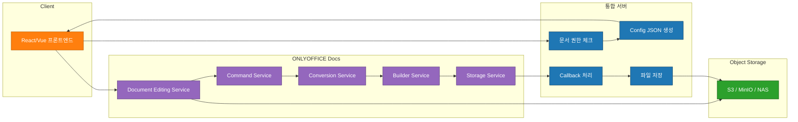

# ONLYOFFICE 연동기 1편 – 문서 편집기 이상의 도전

## 들어가며

ONLYOFFICE는 오픈소스 기반 문서 편집 솔루션이며, 한국에서는 **Wesome**이 공식 Gold Partner 로 기술지원·컨설팅·구매대행을 제공하고 있습니다.

> - OnlyOffice 공식 사이트: https://www.onlyoffice.com
> - Wesome의 OnlyOffice 소개: https://www.wesome.co.kr/onlyoffice/

Wesome 페이지 하단에 있는 **주요 실적** 중 하나에 저희 프로젝트가 포함되어 있습니다. 2024년부터 국내 기업들이 도입을 늘리고 있지만, 보안이 중요한 환경이라 구체적인 구축 사례가 외부에 잘 공개되지 않아 레퍼런스를 찾기 어려웠습니다. 

개발 당시 OnlyOffice 포럼을 뒤지고 메일로 직접 문의 하면서, LLM을 사용할 수 없는 환경에서 작업을 진행했습니다. 그래도 이번 시리즈에서는 **OnlyOffice Docs 구축** 부분만 집중해서 다루기로 했습니다. 실제 코드를 그대로 복사해 쓸 수는 없으니 예제 코드와 다이어그램 위주로 진행합니다.

---

## OnlyOffice란?

> - OnlyOffice Basic Concepts: https://api.onlyoffice.com/docs/docs-api/get-started/basic-concepts/

OnlyOffice Docs는 **설치형 웹 오피스 스위트**입니다. 브라우저에서 Word/Excel/PPT 를 편집하고 실시간 공동 작업도 지원합니다. Google Docs, Office 365 와 비슷해 보이지만, **보안 규제가 강한 기업 환경(금융·제조·공공 등)**에서는 클라우드 SaaS 를 도입하기 어려워 온프레미스 솔루션이 거의 유일한 선택이 됩니다.

### 왜 온프레미스인가?
- 문서가 외부 클라우드에 올라가지 않음
- 사내 스토리지(S3·NAS·Object Storage)만 사용
- JWT 기반 인증으로 기존 시스템과 권한 통합 가능
- 100% 온프레미스 운영 → 내부망에서도 정상 동작
- 한글(HWP/HWPX) 지원

### 핵심 기능
- **문서 보기·편집** (DOCX, XLSX, PPTX, PDF 등)
- **실시간 공동 편집**
- **버전 관리·변경 추적**
- **파일 변환** (HWP → DOCX, DOCX → PDF 등)

---

## OnlyOffice 내부 구성

OnlyOffice Docs 서버는 여러 마이크로서비스로 이루어져 있습니다. 아래 그림은 주요 컴포넌트를 요약한 것입니다.

### 주요 컴포넌트 설명
| 컴포넌트 | 역할 |
|---|---|
| **Client** | 문서 열기 요청, JWT 전달, Editor iframe 렌더링 |
| **Integration Server** | 인증·인가, Config JSON 생성, Callback 처리, 파일 저장 |
| **ONLYOFFICE Docs** | 실제 편집·렌더링, 실시간 협업, 파일 변환 |
| **Object Storage** | 원본·버전 파일 보관 |

---

## 구현 시 고민 포인트

1. **Document Storage Service**
   - Docs Server는 파일을 저장하지 않으며, `callback` 으로 저장 요청만 보냅니다. 실제 파일 입출력 로직은 통합 서버가 구현해야 합니다.
2. **Callback status 처리**
   - `1`: 편집 중
   - `2`: 정상 저장 완료
   - `6`: force‑save (주기적인 자동 저장)
   - `7`: 빈 파일 초기 저장
   - 각 상태에 맞는 로직을 구현하지 않으면 버전 충돌·데이터 손실이 발생합니다.
3. **JWT 보안**
   - 토큰 검증을 건너뛰면 누구든 콜백 엔드포인트를 호출할 수 있어 보안 구멍이 됩니다.
4. **파일 키(key) 관리**
   - `key` 값에 파일명·수정시간을 포함해 동시 편집 시 충돌을 방지합니다.
5. **Docker vs 로컬**
   - Docker 환경에서는 `host.docker.internal` 로 백엔드에 접근하고, 로컬에서는 `localhost` 로 바꿔야 합니다.

---

## 실제 서비스에 적용하면서 느낀 점

- **권한 체크**와 **config JSON**이 정확하지 않으면 문서가 전혀 열리지 않습니다.
- **Callback**을 정확히 구현하지 않으면 저장이 되지 않거나, 빈 파일이 생성됩니다.
- **iframe** 기반 에디터라 디버깅이 번거롭지만, `console` 로그와 네트워크 탭을 활용하면 대부분 해결됩니다.
- **버전 관리**를 제대로 하지 않으면 동시 편집 시 데이터가 뒤섞이는 경우가 발생합니다.

---

## 다음 편에서는…

1. **Config JSON 생성 로직** 상세 구현
2. **Callback status 별 처리** 코드 예시
3. **파일 저장 서비스** 구현 (S3·MinIO 연동)
4. **JWT 검증** 및 보안 강화 방안

이 글이 OnlyOffice 를 처음 접하는 분들에게 개념을 잡는 데 도움이 되길 바랍니다. 다음 글에서 실제 코드와 구현 팁을 공유하겠습니다.

---

*이 레포는 이번 시리즈와 함께 동작하는 예제 레포이며, 전체 흐름을 이해하기 위한 최소 구현을 포함하고 있습니다.*
