# ONLYOFFICE 연동 2편 - Product Requirements Document (PRD) v2.0
## 보안 강화 최소스펙 (Minimal Secure Edition)

## 📄 문서 정보

- **작성일**: 2025-12-02
- **버전**: 2.1 (PM 토론 반영 버전)
- **대상 시스템**: ONLYOFFICE Document Editor Integration Demo v2
- **작성자**: Product Team (after PM Debate)
- **변경 이력**: v1.0 → v2.0 (보안 강화, 프로덕션 준비도 향상)

---

## 🎯 v2.0 핵심 변경사항 요약

| 구분 | v1.0 | v2.0 | 이유 |
|------|------|------|------|
| **Object Storage** | S3 Ninja | **MinIO** | 프로덕션 준비도 |
| **JWT 검증** | 3편 연기 | **2편 필수** | 보안 취약점 |
| **파일 검증** | 확장자만 | **매직 바이트 + MIME** | 업로드 우회 방지 |
| **Router** | TanStack Router | **Next.js App Router** | SSR 호환성 |
| **트랜잭션** | JPA만 | **Saga 패턴** | 분산 시스템 원자성 |
| **일정** | 2주 | **3주** | 보안 작업 추가 |

---

## 1. Executive Summary

### 1.1 목적

본 프로젝트는 1편에서 구축한 기본적인 ONLYOFFICE 연동을 **프로덕션 배포 가능한 수준**의 문서 편집 시스템으로 발전시키는 것을 목표로 합니다. 공식 Java SDK 도입, **보안 강화**, 영구 저장소 연동, 문서 관리 UI 구현을 통해 **실제 사용 가능한** 아키텍처를 구축합니다.

### 1.2 배경 및 v1.0과의 차이점

1편에서 구현한 시스템의 한계:

- **표준화 부재**: 수동으로 Config JSON을 생성하여 유지보수 어려움
- **휘발성 저장소**: 로컬 파일 시스템 사용으로 확장성 제한
- **메타데이터 부재**: 문서 정보를 체계적으로 관리할 수 없음
- **UX 한계**: 단일 에디터 페이지만 존재하여 문서 관리 불가능

**v2.0 PRD의 추가 개선 (v1.0 대비)**:

- **보안 강화**: JWT Callback 검증, 파일 업로드 보안 필수 적용
- **프로덕션 준비**: MinIO 사용, Docker 볼륨, 모니터링 추가
- **안정성**: 분산 트랜잭션 처리, 동시성 제어

### 1.3 핵심 가치 제안

1. **표준화**: ONLYOFFICE 공식 Java SDK를 통한 베스트 프랙티스 적용
2. **보안**: JWT 검증, 파일 업로드 검증으로 프로덕션 수준 보안 확보
3. **확장성**: MinIO 기반 파일 저장으로 프로덕션 배포 가능
4. **관리성**: Database 기반 문서 메타데이터 관리 및 검색
5. **사용성**: 직관적인 문서 목록 UI 및 파일 업로드 기능
6. **안정성**: Saga 패턴으로 분산 시스템 원자성 보장

---

## 2. Product Overview

### 2.1 시스템 아키텍처

#### To-Be (v2.0 - 보안 강화)

```mermaid
graph TB
    subgraph "Client Layer"
        A[Next.js 16<br/>React 19<br/>Next.js App Router]
    end

    subgraph "Application Layer"
        B[Spring Boot Backend<br/>+ ONLYOFFICE SDK<br/>+ JWT Validation<br/>+ File Security]
    end

    subgraph "Data Layer"
        C[(PostgreSQL<br/>Document Metadata<br/>+ Status/Version)]
        D[MinIO<br/>S3-Compatible Storage<br/>+ Volume Mount]
    end

    subgraph "Document Server"
        E[ONLYOFFICE Docs<br/>with JWT]
    end

    subgraph "Observability"
        F[Spring Actuator<br/>Metrics/Health]
    end

    A -->|REST API<br/>HTTPS| B
    B -->|JPA| C
    B -->|S3 SDK| D
    B -->|JWT Signed| E
    B --> F
    E -.->|Callback<br/>JWT Signed| B
```



**v1.0 대비 변경점**:
- ❌ ~~TanStack Router~~ → ✅ Next.js App Router (SSR 호환)
- ❌ ~~S3 Ninja~~ → ✅ MinIO (프로덕션 준비)
- ✅ JWT 검증 추가
- ✅ Spring Actuator 모니터링 추가

### 2.2 주요 컴포넌트

#### Backend Components

| 컴포넌트 | 역할 | 기술 스택 | v1.0 대비 변경 |
|---------|------|----------|---------------|
| **ONLYOFFICE SDK Integration** | 에디터 설정 생성, Callback 처리 표준화 | ONLYOFFICE Java SDK 1.5.0 | 버전 업 |
| **JWT Validation** | Callback 위변조 방지 | java-jwt 4.4.0 | **신규** |
| **File Security Service** | 파일 업로드 검증 (매직 바이트, MIME) | Apache Tika 2.9.1 | **신규** |
| **Document Service** | 문서 CRUD 비즈니스 로직 + Saga | Spring Boot | 보강 |
| **Storage Service** | MinIO 파일 입출력 | AWS S3 SDK v2 | S3 Ninja→MinIO |
| **Repository Layer** | 문서 메타데이터 영속화 | Spring Data JPA | status/version 추가 |
| **Metrics Service** | 애플리케이션 메트릭 수집 | Micrometer + Actuator | **신규** |

#### Frontend Components

| 컴포넌트 | 역할 | 기술 스택 | v1.0 대비 변경 |
|---------|------|----------|---------------|
| **Document List Page** | 문서 목록 조회 및 업로드 | Next.js App Router | Router 변경 |
| **Document Table** | 문서 목록 테이블 UI | TanStack Table | 동일 |
| **Editor Page** | ONLYOFFICE 에디터 렌더링 | React Client Component | 동일 |
| **API Layer** | 서버 상태 관리 및 캐싱 | TanStack Query | Optimistic Update 추가 |

#### Infrastructure Components

| 컴포넌트 | 역할 | 배포 방식 | v1.0 대비 변경 |
|---------|------|----------|---------------|
| **PostgreSQL** | 문서 메타데이터 저장소 | Docker Compose + Volume | 볼륨 추가 |
| **MinIO** | S3 호환 Object Storage | Docker Compose + Volume | **S3 Ninja 대체** |
| **ONLYOFFICE Docs** | 문서 편집 서버 | Docker Compose + JWT | 볼륨 추가 |

---

## 3. User Stories & Use Cases

### 3.1 Primary User: 문서 작성자

#### US-001: 문서 목록 조회
```
As a 문서 작성자
I want to 업로드된 모든 문서를 목록으로 확인
So that 원하는 문서를 빠르게 찾아 편집할 수 있다
```

**Acceptance Criteria:**
- 문서 파일명, 타입, 크기, 생성일, **상태**가 테이블 형태로 표시됨
- 최신 생성일 기준으로 정렬됨
- 문서 클릭 시 에디터 페이지로 이동함
- **PENDING 상태 문서는 회색으로 표시됨** (v2.0 추가)

#### US-002: 문서 업로드
```
As a 문서 작성자
I want to 새로운 문서 파일을 시스템에 업로드
So that ONLYOFFICE 에디터로 편집할 수 있다
```

**Acceptance Criteria:**
- 파일 선택 후 업로드 버튼 클릭 시 파일이 업로드됨
- 업로드 완료 후 문서 목록이 자동으로 갱신됨
- 지원 형식: `.docx`, `.xlsx`, `.pptx`, `.pdf`
- **악의적 파일은 업로드 거부됨 (매직 바이트 검증)** (v2.0 추가)
- **업로드 진행률 표시** (v2.0 추가)

#### US-003: 문서 편집
```
As a 문서 작성자
I want to 목록에서 선택한 문서를 ONLYOFFICE 에디터로 편집
So that 실시간으로 문서를 수정하고 저장할 수 있다
```

**Acceptance Criteria:**
- 에디터가 정상적으로 로드되어 문서 내용이 표시됨
- 편집 후 저장(Ctrl+S) 시 변경사항이 MinIO에 반영됨
- 브라우저 새로고침 시 최신 변경사항이 유지됨
- **JWT 검증으로 안전한 Callback 처리** (v2.0 추가)

#### US-004: 문서 삭제
```
As a 문서 작성자
I want to 더 이상 필요 없는 문서를 삭제
So that 문서 목록을 깔끔하게 관리할 수 있다
```

**Acceptance Criteria:**
- 삭제 버튼 클릭 시 확인 다이얼로그가 표시됨
- 확인 시 DB 레코드 및 MinIO 파일이 모두 삭제됨
- 삭제 후 문서 목록이 자동으로 갱신됨
- **Saga 패턴으로 트랜잭션 보장** (v2.0 추가)

---

## 4. Functional Requirements

### 4.1 Backend API Specifications

#### 4.1.1 문서 목록 API

**Endpoint:** `GET /api/documents`

**Response Format:**
- id: 문서 고유 ID
- fileName, fileType, fileSize: 파일 정보
- status: PENDING/ACTIVE/DELETED
- version: 동시성 제어용
- createdAt, updatedAt: 타임스탐프
- createdBy: 업로더 ID

**v2.0 추가 필드**:
- `status`: PENDING, ACTIVE, DELETED
- `version`: 동시성 제어용

**비즈니스 로직:**
- 모든 ACTIVE 문서를 `created_at DESC` 순서로 조회
- DELETED 상태는 제외 (soft delete)

#### 4.1.2 문서 업로드 API

**Endpoint:** `POST /api/documents`

**보안 강화 (v2.0 신규)**:
- 파일명 새니타이징 (Path Traversal 방지)
- 확장자 검증 (.docx, .xlsx, .pptx, .pdf)
- 파일 크기 제한 (100MB)
- MIME 타입 검증 (Apache Tika)
- 압축 폭탄 검증 (ZIP 크기 제한 1GB)

**비즈니스 로직**:
1. DB에 PENDING 상태로 저장
2. MinIO에 파일 업로드
3. DB 상태를 ACTIVE로 변경 (Saga 패턴)
4. 실패 시 보상 트랜잭션 실행

#### 4.1.3 문서 삭제 API

**Endpoint:** `DELETE /api/documents/{id}`

**비즈니스 로직 (v2.0 Saga 패턴)**:
1. DB에서 문서 조회 (비관적 락, 타임아웃 3초)
2. DB soft delete (상태 변경)
3. MinIO에서 파일 삭제
4. 실패 시 DB 상태 복구 (보상 트랜잭션)

#### 4.1.4 에디터 설정 API

**Endpoint:** `GET /api/documents/{id}/config`

**v1.0**: `GET /api/config?documentId={id}` (RESTful 위반)
**v2.0**: `GET /api/documents/{id}/config` (개선)

**Response Format:**
- config.documentType: word/cell/slide
- config.document: 파일 정보 및 MinIO Presigned URL
- config.editorConfig: Callback URL 및 사용자 정보
- token: JWT 서명 토큰

**v2.0 추가**: `token` 필드 (JWT 서명)

**비즈니스 로직:**
1. DB에서 `id`로 문서 조회
2. ONLYOFFICE SDK의 ConfigService를 사용하여 Config 생성
3. **JWT 토큰 생성 및 서명** (신규)
4. MinIO Presigned URL 생성 (1시간 유효)
5. Callback URL 설정

#### 4.1.5 Callback API (v2.0 보안 강화)

**Endpoint:** `POST /api/callback`

**v2.0 보안 강화**:
1. JWT 검증 (필수) - HS256 서명 검증
2. Payload 검증 - 요청 데이터 유효성 확인
3. 큐 기반 직렬 처리 - `ExecutorService.newSingleThreadExecutor()`로 동시성 제어
4. 비관적 락 - DB 문서 조회 시 타임아웃 3초로 락
5. 버전 증가 - 성공 시 문서 버전 자동 증가

> ⚠️ **주의**: 현재 Callback 큐 처리는 **단일 인스턴스 전용**입니다.
> `ExecutorService.newSingleThreadExecutor()`는 JVM 내에서만 동작하므로,
> 수평 확장(다중 인스턴스) 배포 시 Redis 또는 Kafka 기반 분산 큐로 개선이 필요합니다. (3편 예정)

---

## 5. Non-Functional Requirements

### 5.1 성능 요구사항

| 항목 | 목표 | 측정 방법 | v1.0 대비 변경 |
|------|------|----------|---------------|
| 문서 목록 로딩 | < 500ms | API 응답 시간 (P95) | 측정 방법 명확화 |
| 파일 업로드 (10MB) | < 3초 | 업로드 완료까지 시간 (P95) | 동일 |
| 에디터 초기 렌더링 | < 2초 | DOMContentLoaded 이벤트 | 측정 방법 명확화 |
| Callback 처리 | < 2초 | Callback 수신부터 DB 저장까지 (P95) | 1초→2초 (현실적) |

**v2.0 변경**: 백분위수(P95) 기준 명확화

### 5.2 확장성

- **파일 저장소**: MinIO를 실제 AWS S3로 교체 가능한 인터페이스 설계
- **데이터베이스**: JPA를 통한 DB 독립성 확보 (PostgreSQL ↔ MySQL 전환 가능)
- **동시 사용자**: 최소 10명의 동시 편집 지원 (ONLYOFFICE Docs 스펙 기준)
- **수평 확장**: Backend 무상태(stateless) 설계로 다중 인스턴스 배포 가능

### 5.3 보안 (v2.0 강화)

| 항목 | 요구사항 | 구현 방법 | v1.0 대비 |
|------|----------|----------|-----------|
| **JWT Callback 검증** | 위변조 방지 | HS256 서명 검증 | **2편 필수** |
| **파일 업로드 검증** | 악의적 파일 차단 | Apache Tika MIME 검증 | **강화** |
| **Path Traversal 방어** | 디렉터리 순회 공격 차단 | 파일명 새니타이징 | **신규** |
| **압축 폭탄 방어** | ZIP 폭탄 차단 | 압축 해제 크기 제한 (1GB) | **신규** |
| **파일 크기 제한** | DoS 방지 | 최대 100MB | 50MB→100MB |
| **MinIO 접근 제어** | 인증된 요청만 허용 | Presigned URL (1시간 만료) | 동일 |
| **시크릿 관리** | 평문 저장 금지 | 환경 변수 + 시작 시 검증 | **신규** |

**보안 체크리스트**:
- [x] JWT 검증 구현
- [x] MIME 타입 검증
- [x] Path Traversal 방어
- [x] 압축 폭탄 방어
- [x] 시크릿 환경 변수화
- [x] 시크릿 시작 시 검증 (32자 이상, 기본값 거부)
- [ ] HTTPS 적용 (프로덕션 배포 시)
- [ ] Rate Limiting (3편)

### 5.4 가용성

- **Docker Compose**: 모든 인프라를 로컬에서 재현 가능
- **데이터 영속성**: PostgreSQL, MinIO, ONLYOFFICE 볼륨 마운트
  - PostgreSQL: `/var/lib/postgresql/data`
  - MinIO: `/data`
  - ONLYOFFICE: `/var/lib/onlyoffice` (캐시 및 임시 파일)
- **헬스체크**: 모든 서비스에 healthcheck 설정
- **에러 복구**: Saga 패턴으로 분산 트랜잭션 보상
- **Graceful Shutdown**: Spring Boot 우아한 종료

### 5.5 관찰성 (Observability) - v2.0 신규

#### 5.5.1 모니터링

**Spring Boot Actuator 엔드포인트**:
- `/actuator/health`: 서비스 헬스체크
- `/actuator/metrics`: 메트릭 조회
- `/actuator/prometheus`: Prometheus 포맷

> ⚠️ **프로덕션 배포 시 주의**: Actuator 엔드포인트는 민감한 정보를 노출할 수 있습니다.
> 프로덕션 환경에서는 Spring Security로 `/actuator/**` 경로를 보호하거나,
> 내부 네트워크에서만 접근 가능하도록 설정해야 합니다.

**커스텀 메트릭** (v2.0 신규):
- 문서 업로드: 카운트, 파일 크기, 처리 시간
- Callback 처리: 카운트, 처리 시간, 큐 크기
- MinIO 연동: 실패 횟수, 다운로드 시간

#### 5.5.2 로깅

**로그 레벨 전략**:
- INFO: 비즈니스 이벤트 (업로드, 삭제, Callback 처리)
- DEBUG: 보안 관련 상세 로그 (JWT 검증, 파일 검증)
- WARN: 재시도, 느린 쿼리, 임계값 도달
- ERROR: 예외, Callback 실패, 보안 위반

**구조화 로깅**:
- JSON 형식으로 타임스탐프, 로그 레벨, 로거명, 메시지, 컨텍스트 정보 기록
- 문서 ID, 파일 크기, 처리 시간 등 운영에 필요한 메타데이터 포함

---

## 6. Data Model

### 6.1 Database Schema (v2.0 강화)

#### documents 테이블

| 컬럼명 | 타입 | 제약조건 | 설명 | v1.0 대비 |
|--------|------|---------|------|-----------|
| id | BIGSERIAL | PRIMARY KEY | 문서 고유 ID | 동일 |
| file_name | VARCHAR(255) | NOT NULL | 원본 파일명 | 동일 |
| file_key | VARCHAR(255) | UNIQUE NOT NULL | ONLYOFFICE 문서 키 (불변) | 동일 |
| file_type | VARCHAR(50) | NOT NULL | 확장자 (docx, xlsx, pptx, pdf) | 동일 |
| document_type | VARCHAR(20) | NOT NULL | ONLYOFFICE 타입 (word, cell, slide) | 동일 |
| file_size | BIGINT | NOT NULL | 파일 크기 (bytes) | 동일 |
| storage_path | VARCHAR(500) | NOT NULL | MinIO Object Key | 동일 |
| **status** | VARCHAR(20) | NOT NULL DEFAULT 'PENDING' | **문서 상태** | **신규** |
| **version** | INTEGER | NOT NULL DEFAULT 1 | **동시성 제어용 버전** | **신규** |
| created_at | TIMESTAMP | DEFAULT NOW() | 최초 업로드 시각 | 동일 |
| updated_at | TIMESTAMP | DEFAULT NOW() | 최근 수정 시각 | 동일 |
| **deleted_at** | TIMESTAMP | NULL | **삭제 시각 (soft delete)** | **신규** |
| created_by | VARCHAR(100) | DEFAULT 'anonymous' | 업로더 ID | 동일 |

**인덱스:**
- `idx_file_key` on `file_key` (빠른 조회)
- `idx_created_at` on `created_at` (정렬 최적화)
- **`idx_status` on `status` (상태 필터링)** - v2.0 신규
- **`idx_deleted_at` on `deleted_at` (soft delete 쿼리)** - v2.0 신규

**문서 상태 (status)**:
- **PENDING**: 업로드 진행 중 (MinIO 업로드 전)
- **ACTIVE**: 정상 사용 가능
- **DELETED**: 삭제됨 (soft delete, 복구 가능)

### 6.2 ERD (v2.0)


### 6.3 MinIO Object Structure

```
documents/                              # Bucket
├── doc_1700000000_abc123.docx         # 파일
├── doc_1700000001_def456.xlsx
└── doc_1700000002_ghi789.pptx
```

**Object Key 규칙**:
- 형식: `doc_{timestamp}_{uuid}.{extension}`
- 중복 방지를 위한 timestamp + UUID 조합
- **불변**: 한 번 생성되면 변경되지 않음 (덮어쓰기만 허용)

---

## 7. Integration Points

### 7.1 ONLYOFFICE SDK 연동

**사용 Manager/Service:**

| SDK 컴포넌트 | 용도 | 구현 클래스 | v2.0 변경 |
|-------------|------|------------|-----------|
| SettingsManager | ONLYOFFICE 서버 URL, JWT Secret 관리 | CustomSettingsManager | 환경 변수 사용 |
| DocumentManager | 문서 키 생성, 메타데이터 관리 | CustomDocumentManager | 동일 |
| FileStorageManager | 파일 입출력 추상화 | MinIOFileStorageManager | S3 Ninja → MinIO |
| CallbackManager | Callback 요청 파싱 및 처리 | CustomCallbackManager | JWT 검증 추가 |
| ConfigService | 에디터 Config JSON 생성 | SDK 기본 구현 | JWT 서명 추가 |

**필수 의존성:**
- ONLYOFFICE SDK Java 1.5.0
- java-jwt 4.4.0 (JWT 검증)
- Apache Tika 2.9.1 (파일 검증)

### 7.2 MinIO 연동 (v2.0 변경)

**Docker Compose 설정:**
- API 포트: 9000
- Console UI 포트: 9001 (관리 화면)
- 볼륨 마운트: `/data` (데이터 영속성)
- 환경 변수: MINIO_ROOT_USER, MINIO_ROOT_PASSWORD
- 헬스체크: MinIO API 상태 확인

**Spring Boot 설정:**
- Endpoint: `${MINIO_ENDPOINT:http://localhost:9000}`
- 버킷명: `documents`
- 접근 키/비밀 키: 환경 변수로 관리

**주요 작업:**
- `putObject`: 파일 업로드
- `getObject`: 파일 다운로드
- `deleteObject`: 파일 삭제
- `generatePresignedUrl`: ONLYOFFICE가 접근 가능한 임시 URL 생성 (1시간)

**v1.0 대비 변경**:
- ❌ S3 Ninja (9444) → ✅ MinIO (9000/9001)
- ✅ 관리 콘솔 제공 (http://localhost:9001)
- ✅ 헬스체크 추가
- ✅ 볼륨 마운트

### 7.3 PostgreSQL 연동

**Docker Compose 설정 (v2.0 볼륨 추가):**
- DB 포트: 5432
- 볼륨 마운트: `/var/lib/postgresql/data` (데이터 영속성)
- 환경 변수: POSTGRES_DB, POSTGRES_USER, POSTGRES_PASSWORD
- 헬스체크: PostgreSQL 서버 상태 확인

**Spring Data JPA 설정:**
- DataSource URL: `jdbc:postgresql://{host}:5432/{database}`
- Hibernate DDL-auto: `validate` (프로덕션 모드)
- SQL 포맷팅: 활성화 (로깅 가독성 향상)

**v2.0 변경**:
- ✅ 볼륨 마운트 추가
- ✅ 헬스체크 추가
- ✅ 환경 변수 사용

---

## 8. Technology Stack

### 8.1 Backend (v2.0 변경)

| Layer | Technology | Version | v1.0 대비 변경 |
|-------|-----------|---------|----|
| Framework | Spring Boot | 3.2.x | 동일 |
| Language | Java | 17 | 동일 |
| ORM | Spring Data JPA | 3.2.x | 동일 |
| Database | PostgreSQL | 16 | 동일 |
| Object Storage | **MinIO** (AWS S3 SDK v2) | 2.39.1 | **변경** |
| ONLYOFFICE SDK | docs-integration-sdk-java | **1.5.0** | 1.0.0→1.5.0 |
| **JWT** | **java-jwt** | **4.4.0** | **신규** |
| **File Validation** | **Apache Tika** | **2.9.1** | **신규** |
| **Monitoring** | **Spring Boot Actuator** | **3.2.x** | **신규** |
| **Metrics** | **Micrometer** | **1.12.x** | **신규** |

### 8.2 Frontend (v2.0 변경)

| Layer | Technology | Version | v1.0 대비 변경 |
|-------|-----------|---------|----|
| Framework | Next.js | 16.x | 동일 |
| React | React | 19.x | 동일 |
| Language | TypeScript | 5.x | 동일 |
| Build Tool | Turbopack (Next.js built-in) | - | 동일 |
| **Router** | **Next.js App Router** | **16.x** | **변경** (~~TanStack Router~~) |
| State Management | TanStack Query | 최신 | 동일 |
| Table | TanStack Table | 최신 | 동일 |
| UI Library | shadcn/ui (Tailwind CSS) | 최신 | 동일 |

**중요**: ~~TanStack Router 제거~~ (Next.js와 충돌)

### 8.3 Infrastructure (v2.0 변경)

| Service | Technology | Port | v1.0 대비 변경 |
|---------|-----------|------|----|
| ONLYOFFICE Docs | onlyoffice/documentserver | 8000 | 볼륨 추가 |
| PostgreSQL | postgres:16 | 5432 | 볼륨 추가 |
| **MinIO** | **minio/minio:latest** | **9000/9001** | **신규** (~~S3 Ninja~~) |
| Backend | Spring Boot | 8080 | 동일 |
| Frontend | Next.js Dev Server | 3000 | 동일 |

---

## 9. Out of Scope (3편 이후로 연기)

### 9.1 고급 보안
- 사용자 인증/인가 시스템 (OAuth2, JWT for users)
- 파일 접근 권한 관리 (RBAC)
- Rate Limiting (API 호출 제한)
- 바이러스 스캔 (ClamAV 연동)

### 9.2 협업 기능
- 실시간 동시 편집자 표시
- 문서 공유 링크 생성
- 댓글 및 리뷰 모드

### 9.3 고급 문서 관리
- 버전 히스토리 UI
- 문서 복원 기능
- 폴더 구조 및 카테고리 분류
- 전문 검색 (Elasticsearch)

### 9.4 성능 최적화
- Redis 기반 에디터 Config 캐싱
- CDN을 통한 정적 파일 배포
- 대용량 파일 청크 업로드 (Multipart)

**v2.0 변경**: ~~JWT 기반 Callback 위변조 방지~~ → 2편에 포함

---

## 10. Success Metrics

### 10.1 개발 완료 기준

- [ ] 모든 API 엔드포인트가 Swagger UI에서 테스트 가능
- [ ] 문서 업로드 → 목록 조회 → 편집 → 저장 플로우가 정상 동작
- [ ] PostgreSQL에 문서 메타데이터가 정확히 저장됨
- [ ] MinIO에 파일이 업로드/삭제됨
- [ ] Frontend 라우팅이 정상 작동 (Next.js App Router)
- [ ] TanStack Query로 서버 상태가 자동 동기화됨
- [ ] **JWT Callback 검증이 정상 작동** (v2.0 신규)
- [ ] **파일 업로드 보안 검증 통과** (v2.0 신규)
- [ ] **Saga 패턴으로 트랜잭션 보장** (v2.0 신규)

### 10.2 품질 기준

- [ ] Backend Unit Test 커버리지 > 80% (Service/Security 레이어)
- [ ] **통합 테스트: Callback 시나리오 테스트** (v2.0 신규)
- [ ] **통합 테스트: Saga 보상 트랜잭션** (v2.0 신규)
- [ ] 에디터 초기 로딩 시간 < 2초 (P95)
- [ ] 10MB 파일 업로드 성공률 100%
- [ ] 브라우저 새로고침 후에도 편집 내용 유지
- [ ] **보안 스캔 통과 (OWASP ZAP + 수동 검증 3건)** (v2.0 신규)

### 10.3 문서화 기준

- [ ] README에 전체 실행 방법 기재
- [ ] API 명세서 (Swagger 또는 Markdown)
- [ ] 아키텍처 다이어그램 업데이트
- [ ] **보안 가이드 작성** (v2.0 신규)
- [ ] 블로그 2편 발행 (Medium/Velog)

### 10.4 보안 체크리스트 (v2.0 신규)

- [ ] JWT 검증 로직 테스트 완료
- [ ] 파일 업로드 우회 시도 차단 확인
- [ ] Path Traversal 공격 차단 확인
- [ ] 압축 폭탄 차단 확인
- [ ] 시크릿이 환경 변수로 관리됨
- [ ] `.env` 파일이 `.gitignore`에 추가됨
- [ ] Presigned URL 만료 시간 검증

---

## 11. Risks & Mitigation

### 11.1 기술 리스크

| 리스크 | 영향도 | 완화 방안 | v2.0 변경 |
|--------|--------|----------|----|
| ONLYOFFICE SDK 문서 부족 | 중 | 공식 GitHub 예제 코드 참고, 커뮤니티 포럼 활용 | 동일 |
| **MinIO 데이터 손실** | **중** | **정기 백업, AWS S3 전환 준비** | **신규** |
| TanStack 라이브러리 러닝커브 | 낮 | 공식 문서 및 예제 코드 학습 | 동일 |
| **JWT 구현 복잡도** | **중** | **java-jwt 라이브러리 사용, SDK 예제 참고** | **신규** |

### 11.2 일정 리스크 (v2.0 변경)

| 리스크 | 영향도 | 완화 방안 | v1.0 대비 |
|--------|--------|----------|----|
| **보안 구현 시간 초과** | **중** | **핵심 보안만 2편, 고급 보안은 3편** | **신규** |
| SDK 적용 시간 초과 | 중 | 핵심 기능 우선 구현, 추가 기능은 3편으로 연기 | 동일 |
| DB 마이그레이션 이슈 | 낮 | 기존 파일이 적어 수동 마이그레이션 가능 | 동일 |
| **통합 테스트 작성 지연** | **중** | **핵심 시나리오만 우선, 나머지는 3편** | **신규** |

**일정 조정**: 2주 → **3주** (+1주)

### 11.3 보안 리스크 (v2.0 신규)

| 리스크 | 영향도 | 완화 방안 |
|--------|--------|----------|
| JWT Secret 노출 | 🔴 Critical | 환경 변수 사용, .env 파일 gitignore |
| 파일 업로드 우회 | 🔴 Critical | Apache Tika로 MIME 검증 |
| Callback 위변조 | 🔴 Critical | JWT 서명 검증 필수 |
| 압축 폭탄 공격 | 🟡 High | ZIP 압축 해제 크기 제한 (1GB) |
| DoS (대용량 파일) | 🟡 High | 파일 크기 제한 (100MB) |

---

## 12. Dependencies

### 12.1 외부 의존성

- **ONLYOFFICE Document Server**: 8000 포트에서 정상 동작 필요
- **Docker & Docker Compose**: PostgreSQL, MinIO, ONLYOFFICE 실행 환경
- **인터넷 연결**: ONLYOFFICE SDK, npm 패키지 다운로드

### 12.2 내부 의존성

- 1편에서 구축한 기본 프로젝트 구조
- 기존 `docker-compose.yml`에 PostgreSQL, MinIO 추가 (v2.0: 볼륨 설정 필수)

---

## 13. Implementation Plan (v2.0 - 3주)

### Week 1: 기반 구축 + 보안

| Day | 작업 | 담당 | 우선순위 |
|-----|------|------|---------|
| 1 | MinIO Docker Compose 설정 + 볼륨 | DevOps | 🔴 |
| 1 | PostgreSQL 볼륨 설정 + 헬스체크 | DevOps | 🔴 |
| 2 | ONLYOFFICE SDK 통합 (기본) | Backend | 🔴 |
| 2-3 | JWT Validation 구현 | Backend | 🔴 |
| 3-4 | File Security Service 구현 (Tika) | Backend | 🔴 |
| 4-5 | MinIO Service 구현 | Backend | 🔴 |
| 5 | Document Entity + Repository | Backend | 🔴 |

### Week 2: API + Saga 패턴

| Day | 작업 | 담당 | 우선순위 |
|-----|------|------|---------|
| 6 | 문서 목록 API | Backend | 🔴 |
| 7-8 | 문서 업로드 API + Saga 패턴 | Backend | 🔴 |
| 8 | 문서 삭제 API + Saga 패턴 | Backend | 🔴 |
| 9 | 에디터 설정 API + JWT 서명 | Backend | 🔴 |
| 9-10 | Callback API + 큐 처리 | Backend | 🔴 |
| 10 | Spring Actuator 설정 | Backend | 🟡 |

### Week 3: Frontend + 테스트

| Day | 작업 | 담당 | 우선순위 |
|-----|------|------|---------|
| 11-12 | Next.js App Router 설정 | Frontend | 🔴 |
| 12-13 | 문서 목록 페이지 (TanStack Query/Table) | Frontend | 🔴 |
| 13 | 업로드 버튼 + 진행률 표시 | Frontend | 🔴 |
| 14 | 에디터 페이지 (Client Component) | Frontend | 🔴 |
| 14 | Optimistic Update 적용 | Frontend | 🟡 |
| 15 | 통합 테스트: Callback 시나리오 | Backend | 🔴 |
| 15 | 통합 테스트: Saga 보상 | Backend | 🔴 |
| 16-17 | E2E 테스트 (기본 시나리오) | QA | 🟡 |
| 17-18 | 보안 테스트 (OWASP) | Security | 🔴 |
| 18-19 | 문서화 (README, API 명세) | All | 🔴 |
| 19-20 | 블로그 2편 작성 | Writer | 🔴 |

**총 20일 (4주 - 버퍼 1주 포함)**

---

## 14. Testing Strategy (v2.0 강화)

### 14.1 단위 테스트 (Service/Security 80% 커버리지)

**주요 테스트 대상:**
- FileSecurityService: 악의적 파일 형식 거부
- JwtValidator: 위변조된 JWT 토큰 거부
- DocumentService (Saga): MinIO 업로드 실패 시 DB 롤백

### 14.2 통합 테스트 (v2.0 신규)

**Testcontainers를 사용한 테스트:**
- PostgreSQL + MinIO 컨테이너 실행
- 유효한 JWT로 Callback 처리 검증
- 잘못된 JWT 거부 확인
- DB 업데이트 + MinIO 파일 업로드 동시 검증

### 14.3 E2E 테스트 (기본 시나리오)

**Playwright를 사용한 전체 플로우 검증:**
1. 문서 목록 페이지 접속
2. 파일 업로드 및 진행률 확인
3. 업로드 완료 후 목록 자동 갱신
4. 문서 클릭 → 에디터 페이지 이동
5. ONLYOFFICE 에디터 정상 로드 확인

---

## 15. Appendix

### 15.1 용어 정의

| 용어 | 설명 |
|------|------|
| **Document Key** | ONLYOFFICE가 문서 수정 여부를 판단하는 고유 식별자 (불변) |
| **Callback** | 문서 편집 완료 시 ONLYOFFICE Docs가 Backend로 전송하는 Webhook |
| **Presigned URL** | 임시 접근 권한이 부여된 MinIO 객체 URL (1시간 만료) |
| **TanStack Query** | React의 서버 상태 관리 라이브러리 (캐싱, 자동 갱신) |
| **Saga 패턴** | 분산 트랜잭션의 원자성을 보장하는 보상 트랜잭션 패턴 |
| **Optimistic Update** | 서버 응답 전에 UI를 먼저 업데이트하는 UX 패턴 |
| **Soft Delete** | 실제 삭제 대신 deleted_at 플래그로 논리 삭제 |

### 15.2 참고 자료

#### ONLYOFFICE
- [ONLYOFFICE Java SDK GitHub](https://github.com/ONLYOFFICE/docs-integration-sdk-java)
- [ONLYOFFICE API Documentation](https://api.onlyoffice.com/editors/config/)
- [ONLYOFFICE Security Guide](https://helpcenter.onlyoffice.com/docs/installation/docs-securityguide.aspx)
- [ONLYOFFICE JWT Configuration](https://helpcenter.onlyoffice.com/docs/installation/docs-configure-jwt.aspx)

#### MinIO
- [MinIO Documentation](https://www.min.io/product/aistor/s3-compatibility)
- [MinIO Docker Setup](https://hub.docker.com/r/minio/minio)

#### Spring Boot
- [Spring Boot Actuator](https://docs.spring.io/spring-boot/reference/actuator/index.html)
- [Spring Boot S3 Integration](https://reflectoring.io/spring-boot-s3/)

#### Frontend
- [Next.js App Router](https://nextjs.org/docs/app)
- [TanStack Query Docs](https://tanstack.com/query/latest)
- [TanStack Table Docs](https://tanstack.com/table/latest)

### 15.3 환경 변수 템플릿

**필수 환경 변수:**

데이터베이스:
- `POSTGRES_HOST`, `POSTGRES_DB`, `POSTGRES_USER`, `POSTGRES_PASSWORD`

MinIO:
- `MINIO_ENDPOINT`, `MINIO_ROOT_USER`, `MINIO_ROOT_PASSWORD`, `MINIO_ACCESS_KEY`, `MINIO_SECRET_KEY`

ONLYOFFICE:
- `ONLYOFFICE_SERVER_URL`
- `ONLYOFFICE_JWT_SECRET` (최소 32자, 시작 시 검증)

애플리케이션:
- `SERVER_BASE_URL`

**배포 전 확인사항:**
- `.env` 파일은 `.gitignore`에 추가
- 프로덕션 환경의 모든 비밀은 환경 변수로 관리
- JWT Secret은 기본값이 아닌 안전한 값으로 변경

---

## 16. v1.0 → v2.0 변경점 상세

### 16.1 아키텍처 변경

| 컴포넌트 | v1.0 | v2.0 | 변경 이유 |
|---------|------|------|----------|
| Object Storage | S3 Ninja | MinIO | 프로덕션 준비도, 안정성 |
| Router | TanStack Router | Next.js App Router | SSR 호환성 |
| JWT 검증 | 3편 연기 | 2편 필수 | 보안 취약점 방지 |
| 트랜잭션 | JPA만 | Saga 패턴 | 분산 시스템 원자성 |
| 모니터링 | 없음 | Actuator | 운영 가시성 |

### 16.2 보안 강화

| 항목 | v1.0 | v2.0 |
|------|------|------|
| Callback 검증 | ❌ | ✅ JWT 서명 검증 |
| 파일 업로드 | 확장자만 | ✅ MIME + 매직 바이트 |
| Path Traversal | ❌ | ✅ 파일명 새니타이징 |
| 압축 폭탄 | ❌ | ✅ ZIP 크기 제한 |
| 시크릿 관리 | 평문 | ✅ 환경 변수 |

### 16.3 데이터 모델 변경

| 컬럼 | v1.0 | v2.0 |
|------|------|------|
| status | ❌ | ✅ PENDING/ACTIVE/DELETED |
| version | ❌ | ✅ 동시성 제어용 |
| deleted_at | ❌ | ✅ Soft delete |

### 16.4 일정 변경

| 항목 | v1.0 | v2.0 | 이유 |
|------|------|------|------|
| 기간 | 2주 | 3주 | 보안 작업 추가 |
| 보안 작업 | 0일 | 5일 | JWT, 파일 검증, Saga |
| 테스트 | 2일 | 4일 | 통합 테스트 추가 |

---

## 📝 Approval

### Critical PM Review

✅ **승인 (Approved with Conditions)**

**승인 이유**:
- 모든 Critical 보안 이슈 해결
- 프로덕션 배포 가능한 수준으로 개선
- 명확한 보안 체크리스트 및 테스트 전략
- 현실적인 일정 (3주)

**조건부 요구사항**:
1. 통합 테스트 필수 완료 (Callback, Saga)
2. 보안 테스트 통과 (OWASP Top 10)
3. 모든 시크릿 환경 변수화 검증

### Optimistic PM Review

✅ **승인 (Approved)**

**승인 이유**:
- 핵심 기능 범위 유지
- 점진적 개선 전략 (2편 → 3편)
- 3주 일정으로 안정적 구현 가능

---

**문서 버전**: 2.1
**최종 수정일**: 2025-12-04
**다음 문서**: 구현 가이드 (Implementation Guide)