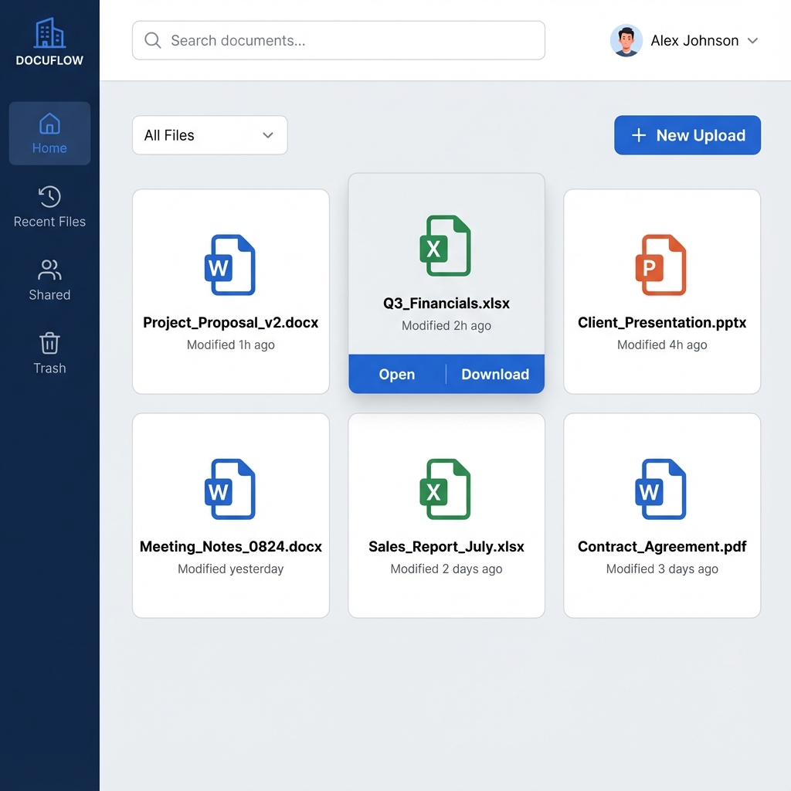
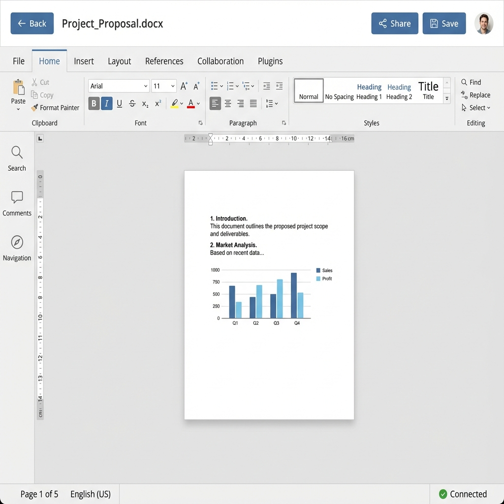
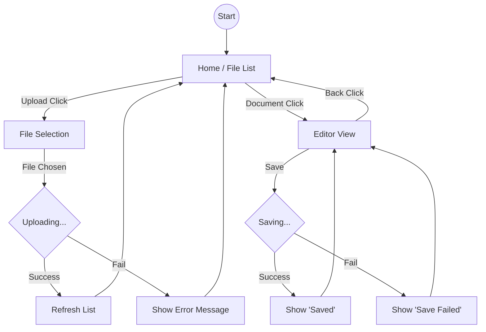

# ONLYOFFICE 연동 2편 - UI Design Document

## 📄 문서 정보

- **작성일**: 2025-11-25
- **버전**: 1.0
- **대상 시스템**: ONLYOFFICE Document Editor Integration Demo v2
- **작성자**: Product Team

---

## 1. 개요

본 문서는 ONLYOFFICE 연동 데모 프로젝트의 프론트엔드 화면 구성을 정의합니다. 사용자가 문서를 조회하고, 업로드하고, 편집기로 진입하는 흐름을 시각화합니다.

---

## 2. 화면 목록

| 화면 ID | 화면명 | 설명 |
|---------|--------|------|
| UI-001 | Home / File List | 문서 목록 조회 및 파일 업로드 |
| UI-002 | Editor View | ONLYOFFICE 에디터 실행 화면 |

---

## 3. 상세 설계

### 3.1 UI-001: Home / File List Screen

사용자가 애플리케이션에 접속했을 때 처음 마주하는 메인 화면입니다. 업로드된 문서들을 카드 형태로 보여주고, 새로운 문서를 업로드하거나 편집을 시작할 수 있습니다.

#### 3.1.1 Wireframe Description

> **Layout Structure**
> - **Header**: 상단 고정. 앱 타이틀과 설정 버튼 포함.
> - **Body**: 중앙 정렬. 문서 카드들이 그리드 또는 리스트 형태로 배치됨.
> - **Footer**: 하단 고정. GitHub 저장소 링크 포함.

#### 3.1.2 Mockup (Mermaid)

#### 3.1.3 UI Components

| 컴포넌트 | 위치 | 기능 설명 |
|---------|------|-----------|
| **App Header** | Top | 애플리케이션 로고 및 타이틀 표시. 우측에 설정 아이콘 배치. |
| **Upload Area** | Body Top | 파일 업로드 버튼 또는 Drag & Drop 영역. |
| **Document Card** | Body Center | 개별 문서 정보 표시 컨테이너. |
| - *Icon* | Card Top | 파일 확장자(docx, xlsx, pptx)에 따른 아이콘 표시. |
| - *Metadata* | Card Middle | 파일명, 마지막 수정일 표시. |
| - *Action Buttons* | Card Bottom | **Open in Editor**: 에디터 페이지로 이동. **Download**: 원본 파일 다운로드. |
| **Footer** | Bottom | 저작권 정보 및 GitHub 소스 코드 링크. |

#### 3.1.4 Interactions

1. **문서 열기 (Open in Editor)**
   - 클릭 시 `/editor/:id` 경로로 이동.
   - 새 탭이 아닌 현재 탭에서 전환 (SPA).

2. **파일 다운로드 (Download)**
   - 클릭 시 브라우저 다운로드 트리거.
   - 백엔드 API를 통해 Presigned URL 또는 스트림 다운로드 수행.

3. **설정 (Settings)**
   - 모달 팝업 오픈.
   - 사용자 이름 변경 (익명 사용자 닉네임 설정 등) 기능 제공.

---

### 3.2 UI-002: Editor View

사용자가 문서를 선택했을 때 진입하는 전체 화면 에디터 페이지입니다. ONLYOFFICE 에디터를 임베딩하며, 좌측 사이드바를 통해 문서 정보를 제공합니다.

#### 3.2.1 Wireframe Description

> **Layout Structure**
> - **Top Bar**: 네비게이션 및 현재 파일명 표시.
> - **Left Sidebar**: 파일 메타데이터(타입, 크기, 저장 시간) 및 상태 표시.
> - **Main Content**: ONLYOFFICE Document Editor iframe 영역.
> - **Bottom Status Bar**: 연결 상태 및 자동 저장 표시.

#### 3.2.2 Mockup (Mermaid)

#### 3.2.3 UI Components

| 컴포넌트 | 위치 | 기능 설명 |
|---------|------|-----------|
| **Top Bar** | Top | **Back Button**: 목록 화면으로 이동. **Filename**: 현재 편집 중인 파일명 표시. |
| **Sidebar** | Left | **File Info**: 확장자, 파일 크기 표시. **Save Status**: 마지막 저장 시간 및 저장 성공 여부 표시. |
| **Editor Area** | Center | ONLYOFFICE Docs API가 렌더링되는 `div` 컨테이너. |
| **Status Bar** | Bottom | 소켓 연결 상태(Connected/Disconnected) 및 자동 저장 활성화 여부 표시. |

#### 3.2.4 Visual Style

- **Theme**: Light Mode
- **Colors**:
  - Primary: Blue (`#007BFF`) - 버튼 및 강조 텍스트
  - Supporting: Gray (`#6C757D`) - 보조 텍스트
  - Borders: `#E0E0E0` (1px solid)
- **Typography**: Sans-serif (14px standard, 18px bold headings)
- **Spacing**: 16px padding (Consistent)

---

## 4. User Flow

사용자의 주요 행동 흐름을 시각화합니다.

---

## 5. UI States

각 화면의 주요 상태에 대한 정의입니다.

| 상태 (State) | Home Screen | Editor View |
|-------------|-------------|-------------|
| **Loading** | 문서 목록 영역에 Skeleton UI 또는 Spinner 표시 | 화면 중앙에 "Editor Loading..." 스피너 및 로고 표시 |
| **Empty** | "등록된 문서가 없습니다. 첫 번째 문서를 업로드해보세요!" 안내 문구 및 일러스트 | (해당 없음) |
| **Error** | "문서 목록을 불러오지 못했습니다." 메시지 및 [재시도] 버튼 | "문서 서버에 연결할 수 없습니다." 오버레이 및 [새로고침] 버튼 |
| **Partial** | (업로드 중) 카드 리스트 상단에 Progress Bar가 포함된 임시 카드 표시 | (저장 중) 상단 상태 바에 "Saving..." 표시 및 스피너 회전 |
